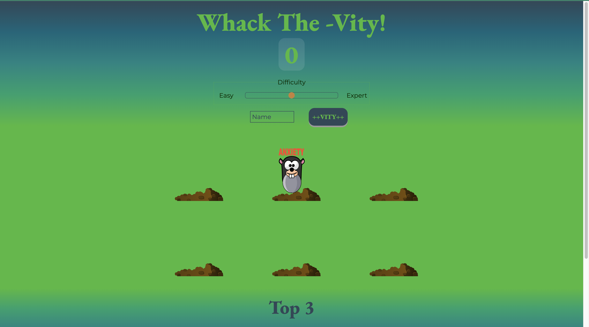
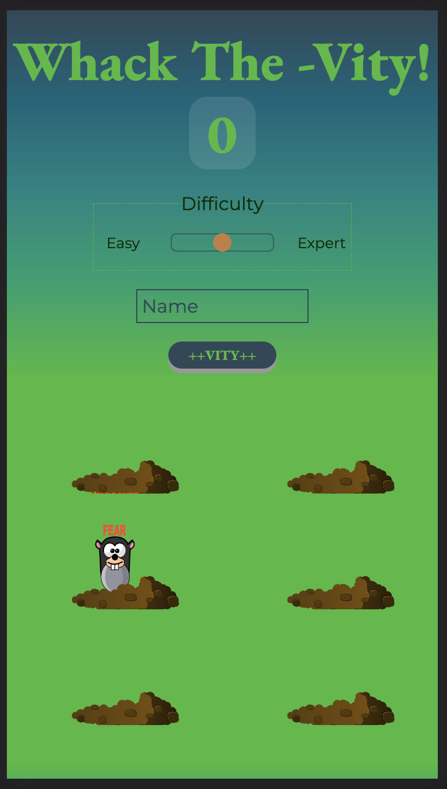

# VITY

**VITY** is a light-hearted game to add positivity  in your life by Whacking the (negative) moles. 

Research shows that [gaming boosts](https://edition.cnn.com/2020/11/16/health/video-games-mental-health-study-wellness-scli-intl/index.html "CNN")
productivity, mood and happiness ☺️. Thus, making a person mentally healthy 🤩.

Play the game according to your convenience for 10 to 15 minutes daily for optimal results 😉

## How to Play 🤨
* Set the difficulty level, enter your name and press VITY(go).
* The moles will come out randomly one-by-one for time based on your difficulty level.
* Press on the mole while it is up to earn a single point. Number of moles tapped = Number of points scored. 
* Compete with your 3 highest previous scores on the local leaderboard. 
* All the best 👍

## Gameplay Screenshots

### Desktop 🖥

### Mobile 📱

#### ✌️
#### SPIRIT OUT 4️⃣2️⃣